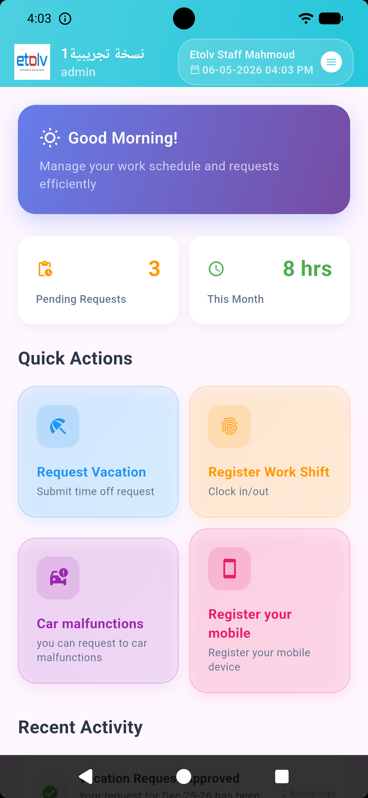
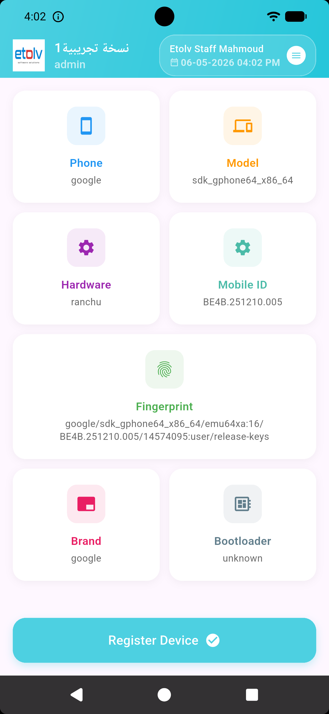
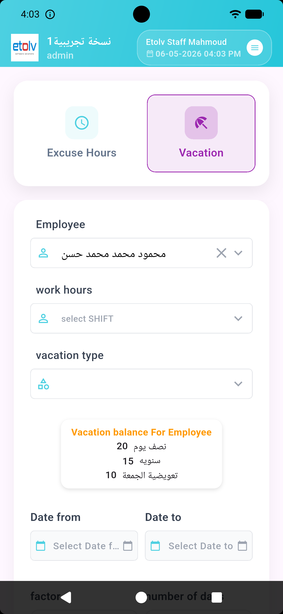
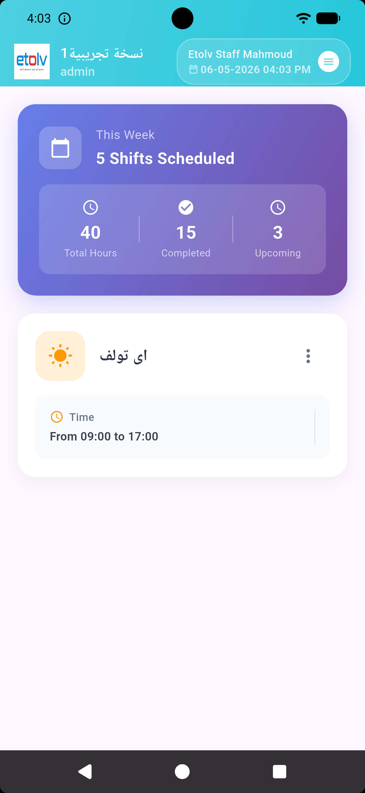

<h1 align="center">HR Mobile Service App</h1>

  A secure mobile service experience for HR-related daily operations.

  
  

  
  

  Click <b>Download Latest Version</b> to get the newest app release directly.

---

## About The Service

HR Mobile is designed to provide a simple and trusted experience for employees and HR teams. The app helps users access essential HR services from anywhere through a clear and fast mobile interface.

### What You Can Do

- Access HR services in one place
- Complete identity and attendance related actions securely
- Follow requests and daily status updates
- Use the app in Arabic and English

---

## Download

1. Open tags page:
  https://github.com/etolv2023/HR-Mobile/tags
2. Choose the required version
3. Open assets for that version
4. Download the mobile app file

Direct latest version download page:
https://github.com/etolv2023/HR-Mobile/releases/latest

Direct latest APK files:
- Portal APK: https://github.com/etolv2023/HR-Mobile/releases/latest/download/app-portal.apk
- Trio APK: https://github.com/etolv2023/HR-Mobile/releases/latest/download/app-trio.apk

---

## App Demonstration

### Brand

  

### Service Screens

The following section can present real app screens for users:

- Welcome and sign-in screen
- Verification screen
- Main service dashboard

Example preview layout:

  
  
  
  
  

---

## Who Is It For

- Employees
- Team leaders
- HR operations teams

---

## Official Repository

https://github.com/etolv2023/HR-Mobile
